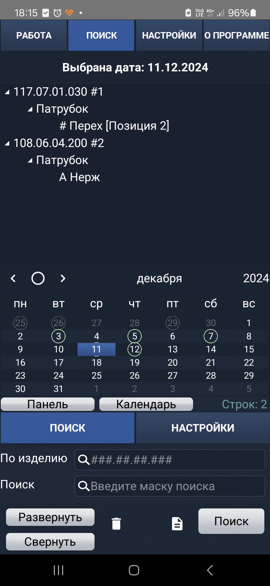

# PZM_Soft
Данный проект предназначен для использования в рабочих целях. Он был разработан на Delphi для операционной системы Android.

---
### AutoToolsFronius
Программа предназначена для автоматического выполнения расчетов, связанных с процессом сварки.

   

---
### WeldingAccountOffline
Программа представляет собой систему для управления записями выполненных сварочных работ.

